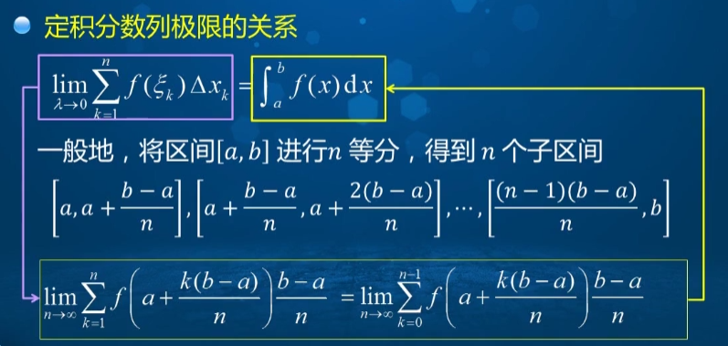

#### 函数的可积性

##### 定理1 

若函数$f(x)$在$[a,b]$上可积，则$f(x)$在$[a,b]$上有界;

若函数$f(x)$在$[a,b]$上连续，则$f(x)$在$[a,b]$上必可积。

<b>证明：</b>

假设$f(x)$在$[a,b]$上无界，对于$[a,b]$

的任何一个分割，记为$T$

$T: a = x_0<x_1<x_2<...<x_n=b$

取$\xi_k \in [x_{k-1}, x_k](k=1,2,...,n)$，作和数

$I_n=\sum^n_{k=1}f(\xi_k)\Delta x_k$

由于$[a,b]$是无界的

所以存在某一区域$[x_{i-1},x_i]$使得$f(x)$在这个区间上无界

使$I_n=\sum_{k \ne i}f(\xi_k)\Delta x_k+f(\xi_i)\Delta x \triangleq G+f(\xi_k)\Delta x$

由于$f(x)$在$[x_{i-1},x_i]$上是无界的，则$\forall M > 0$,

$\exist\xi_k\in[x_{i-1}, x_i]$，使得

$|f(\xi_i)|>\frac{|G|+M}{\Delta x_i}$

根据三角不等式，则

$|I_n|=|G+f(\xi_i)\Delta x_i| \\ \ge |f(\xi_i)\Delta x_i|-|G|\\>\frac{|G|+M}{\Delta x_i}\Delta x_i-|G|\\=M$

即$\lim_{\lambda -> 0}I_n$不存在，所以$f(x)$在$[a,b]$上不可积。

<b>结论：</b>

函数$f(x)$在区间$[a,b]$上有界，且只有<b>有限多个间断点</b>,则$f(x)$在区间$[a,b]$上可积。

如果函数$f(x)$在区间$[a,b]$上单调增加或单调减少，则$f(x)$在区间$[a,b]$上可积。

##### 达布(Darboux)上和与下和

设$T=\{\Delta_k=[x_{k-1}, x_k], k=1,2,...,n\}$为对$[a,b]$的任意一个分割，由$f(x)$在$[a,b]$上有界，所以$f(x)$在每个$\Delta_k$上由上下确界：

$\displaystyle M_k=\sup_{\Delta_k}f(x), m_k=\inf_{\Delta_k}f(x)$

称$S(T)=\sum^n_{k=1}M_k\Delta x_k, s(T)=\sum^n_{k-1}m_k\Delta x_k$为$f(x)$关于分割$T$的<b>达布上和与达布下和</b>

##### 定理2(可积的充分必要条件)

函数$f(x)$在$[a,b]$上可积的充要条件是：$\forall\epsilon > 0, \exist[a,b]$的分割$T={\Delta_k}$，使得$S(T)-s(T) < \epsilon$

记$\omega_k=M_k-m_k$，称为函数在$\Delta_k$上的振幅，所以

$S(T)-s(T)=\sum_T\omega_k\Delta x_k$

##### 定积分与数列的关系

#### 积分中值定理

设函数$f(x)\in C[a,b]$，则至少存在一点$\xi \in [a,b]$，使

$\int^b_af(x)dx=f(\xi)(b-a)$

$f(\xi)=\frac{1}{b-a}\int^b_af(x)dx,\frac{1}{b-a}\int^b_af(x)dx$被称为函数$f(x)$在$[a,b]$上的平均值。

##### 推广的积分第一中值定理

设$f(x),g(x)$在闭区间$[a,b]$上连续，且$g(x)$在$[a,b]$上不变号，则至少存在一点$\xi\in[a,b]$，使得

$\displaystyle \int^b_af(x)g(x)dx=f(\xi)\int^b_ag(x)dx$

