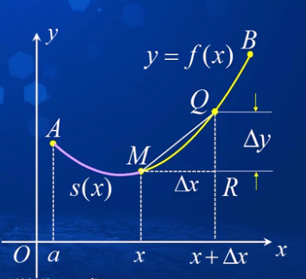
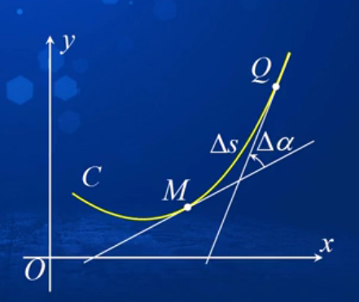

# 函数

## 极限

### 洛必达法则

#### $\frac{0}{0}$型不定式极限的洛必达法则

设函数$f(x)$,$g(x)$在区间$(a, a+\delta)$内满足：

1. $\displaystyle \lim_{x \to a^+}f(x) = \lim_{x \to a^+}g(x)=0$
2. $f(x)$,$g(x)$在$(a, a+\delta)$内可导，且$g'(x)\ne0$
3. $\displaystyle \lim_{x \to a^+}\frac{f'(x)}{g'(x)}$存在（或$\displaystyle \lim_{x \to a^+}\frac{f'(x)}{g'(x)}=\infin$）

则

<b>$\displaystyle \lim_{x \to a^+}\frac{f(x)}{g(x)} = \lim_{x \to a^+}\frac{f'(x)}{g'(x)}$（或$\lim_{x \to a^+}\frac{f(x)}{g(x)} =\infin$）</b>

对于$x \to \infin$结论也成立

其他公式查看百度，不定式极限的洛必达法则

## 函数求根

### 零值定理

参考百度

### 非线性方程

<b>线性方程:  $y=ax+b$</b>

<b>非线性方程：$f(x) = 0$（其中$f(x)$不具有$ax+b$的形式）</b>
若有$x^*$使得$f(x^*)=0$,则称$x^*$为方程$f(x)=0$的<b>根</b>，或称为函数$f(x)$的<b>零点</b>。

求方程$f(x)=0$实根

1. 可求精确根（根的形式可能很复杂）
2. 无法求精确根$\to$求近似根

### 求近似根方法

#### 区间收缩法

1. 确定初始含根区间
2. 收缩含根区间

#### 牛顿迭代法

<b>简单迭代法的基本思想</b>

将方程$f(x)=0$变换为一个等价形式$x= \phi(x)$，构造迭代格式
$\displaystyle x_{k+1} = \phi(x_k)$

其中$\phi(x)$称为<b>迭代函数</b>，$x=\phi(x)$也称为<b>不动点方程</b>。

对给定的初值$x_0$，由迭代格式得到的序列$\{x_k\}$称为<b>迭代序列</b>.

对于连续函数$\phi(x)$，如果迭代序列${x_k}$收敛于$x^*$，那么有
$\displaystyle x^* = \lim_{k \to \infin}x_{k+1}=\lim_{k \to \infin}\phi(x_k)=\phi(x^*) \to f(x^*) = 0$

<b>原理</b>：将非线性方程线性化

设$f(x)$在其零点$x^*$附近连续可微，$x_0$是$f(x)=0$的近似根，在$x_0$附近用$f(x)$的一阶泰勒多项式近似$f(x)$，有
$f(x) \approx p_1(x)=f(x_0)+f'(x_0)(x-x_0)$

当$f'(x_0) \ne 0$时，可以取线性方程$p_1(x) = 0$的根
$\displaystyle x_1 = x_0 - \frac{f(x_0)}{f'(x_0)}$（$x^*$的第一次近似值）

同理，当$f'(x_1) \ne 0$时，有<b>$\displaystyle x_2=x_1 - \frac{f(x_1)}{f'(x_1)}$（$x^*$的第二次近似值）</b>

以此类推，当$f'(x_k) \ne 0$时，有
$\displaystyle x_{k+1}=x_k - \frac{f(x_k)}{f'(x_k)}, k=0,1,2,...$（$x^*$的第k次近似值）

这个公式也叫做<b>牛顿迭代公式</b>。

<b>迭代函数</b>为

$\displaystyle \phi(x)=x-\frac{f(x)}{f'(x)}$

<b>条件</b>：$f(x)$在$x^*$附近连续可微且$f'(x) \ne 0$

##### 收敛性

设$f(x)$满足：

1. 在$[a,b]$上连续，且$f(a)f(b)<0$
2. 在$[a,b]$上$f'(x)$及$f''(x)$不变号

$f(x)=0$在$(a,b)$内有唯一的实根$x^*$

###### 定理1

设$f(x)$在$[a,b]$上有二阶导数，且满足：

1. $f(a)<0,f(b)>0$
2. $f'(x)>0,x \in [a,b]$
3. $f''(x)>0,x\in [a,b]$

那么，方程$f(x)=0$在$(a,b)$内有唯一实数根$x^*$，且当取$x_0=b$，按牛顿迭代公式给出的点列${x_n}$收敛于$x^*$.

###### 误差估计

由微分中值定理可以得到

$f(x_n)-f(x^*)=f'(\eta)(x_n-x^*)$($\eta$ 在$x_n$和$x^*$之间)

因为$f(x^*)=0$，所以

$\displaystyle x_n-x^*= \frac{f(x_n)}{f'(\eta)}$

记$m=min_{[a,b]}|f'(x)|$，则得

$\displaystyle x_n-x^* \le \frac{f(x_n)}{m}$

###### 收敛速度

$\displaystyle \lim_{k \to \infin}\frac{x_{k+1}-x^*}{(x^*-x_k)^2}=\frac{f''(x^*)}{2f'(x^*)}$

## 函数的极值及最优化应用

### 最大值和最小值

#### 最大值

设函数$f(x)$定义在集合$D$上，若存在$D$上的点$c$使得
$f(x) \leq f(c)$

对于$D$上的一切$x$成立，则称$f(c)$为函数$f(x)$在$D$上的<b>最大值</b>（也称为$f(x)$在$D$上取得最大值），记为
$\displaystyle M=f(c)=^{max}_{x \in d}f(x)$

#### 最小值

最大值定义取反

### 极值

#### 定义1

设函数$f(x)$在$x_0$的某邻域$(x_0-\delta, x_0+\delta)$内有定义，如果对于该邻域内异于$x_0$的点$x$，恒有
<b>$\displaystyle f(x) < f(x_0)$</b>，

那么就称$f(x_0)$是函数$f(x)$的一个<b>极大值</b>，$x_0$称为函数$f(x)$的极大值点。

反之可以得到<b>极小值</b>的定义。

我们将<b>极大值和极小值</b>统称为<b>极值</b>，取得极值的点统称为<b>极点</b>。

#### 定理1 费马引理（极值与导数的关系）

设函数$f(x)$在$x_0$点处可导，且存在$x_0$的$\delta$邻域$U(x_0, \delta)$，使得当$x \in U(x_0,\delta)$时，恒有
$f(x) \ge f(x_0)$（或$f(x)\le f(x_0)$），

那么$f'(x_0)=0$。

导数等于0的点称为函数的<b>驻点</b>或<b>稳定点</b>

<b>证明：</b>

设$x\in u(x_0,\delta)$时，

$f(x) \le f(x_0)$

即$|x-x_0|<\delta$时，有$f(x) \le f(x_0)$

由于$|x-x_0|<\delta$，有

$\displaystyle \frac{y(x)-y(x_0)}{x-x_0} \le 0$

由函数保号性可得，

$f_+^{'}(x_0)= '\displaystyle \lim_{x\to x_0}\frac{y(x)-y(x_0)}{x-x_0}\le 0$

同理可得

$f_-^{'}(x_0)= '\displaystyle \lim_{x\to x_0}\frac{y(x)-y(x_0)}{x-x_0}\ge 0$

由于$f(x)$在$x_0$处可导，有

$f'(x_0)=f_-^{'}(x_0)=f_+^{'}(x_0)=0$

#### 定理2

1. 如果函数$f(x)$在区间$(x_0-\delta,x_0)$递增，在$(x_0, x_0+\delta)$递减，则$f(x)$在$x_0$处取得<b>极大值</b>。
2. 反之就是取得<b>极小值</b>。
3. 如果函数在该点的左右邻域都增或减，则该点不取得极值。

问题：极值点附近是否一定有单调性

$f(x)=\begin{cases}x^2+|xsin{1}{x}|,&x \neq 0 \\ 0, & x=0 \end{cases}$

函数$f(x)$在$x=0$取得极小值

<b>函数取极值不一定要两侧都有相应的单调性</b>

#### 需要特别注意

对于可微函数，极值点一定是驻点

几何意义：函数的图形在极值点处对应水平切线，但驻点不一定是极值点。

###  闭区间上连续函数的最值求法

设函数$f(x)$在闭区间$[a,b]$内连续，求闭区间上连续函数最值的<b>一般步骤</b>为：

1. 求出$f(x)$在区间$(a,b)$内的所有驻点和不可导点：
   $\displaystyle x_1,x_2,...,x_n$；
2. 求$f(x)$在$\displaystyle x_1,x_2,...,x_n$及区间端点$a,b$的函数值：
   $f(a), f(x_1), f(x_2),...f(x_n),f(b)$；
3. 比较各点函数值的大小，最大者为所求最大值，最小者为所求的最小值。

<b>问题</b>：求$f(x)=|x|e^x$在区间[-2,1]上的最大值和最小值。

解：$f(x)$在$x=0$处不可导

$\displaystyle f'(x)=\begin{cases}(x+1)e^x,&x>0 \\ -(x+1)e^x,&x<0 \end{cases}$

$f'(x)=0 $则$x=-1$

比较 $f(-2),f(-1),f(0),f(1)$的函数值

### 单峰函数的最大值与单谷函数的最小值

#### 定义2 

设函数$f(x)$在$(a,b)$内连续，如果存在一点$x_0\in (a,b)$，当$a<x<x_0$时，$f(x)$<b>严格单调递增（减）</b>，当$x_0<x<b$时，$f(x)$<b>严格单调递减（增）</b>，则称$f(x)$为<b>单峰（谷）函数</b>

单峰函数 极大值=最大值

单谷函数 极小值=最小值

#### 问题

1. 用输油管把离岸12公里的一座油井和沿岸往下20公里处的炼油厂连接起来，如果水下输油管的铺设成本为每公里50万元，陆地输油管的铺设成本为每公里30万元。问应如何铺设水下和陆地输油管，使总的连接费用最小？
   $f(x)=50\sqrt{144+x^2}+30(20-x)(0 \le x \le 20)$
   $\displaystyle f'(x)=\frac{50x}{\sqrt{144+x^2}}+30=0$，解得到$x = 9(km)$
   $f(0)=1200，f(20)=200\sqrt{34}，f(9)=1080$
   $min{f(0),f(20),f(9)}=f(9)=1080$
2. 一个边长为$a$的正方形铁片，在四个角各减去一个边长为$x$的小正方形，然后折成一个无盖长方体容器，问当$x$取何尺寸时，才能使容器的容积最大？
   解：

## 多项式逼近

### 以"直"代“曲”

$f(x_0 + \Delta x) \approx f(x_0) + f'(x_0)\Delta x$

ex:

1. $f(x) = \sqrt x = \sqrt{x_0 + \Delta x} \approx \sqrt{x_0} + \frac{1}{2\sqrt{x_0}}*\Delta x$
2. $\sqrt{1.05} = \sqrt{1 + 0.05} \approx 1 + \frac{1}{2}*0.05 = 1.025$

### 二项式定理

$\displaystyle (1 + x)^\alpha = 1 + \alpha x + \frac{a(a - 1)}{2!}x^2 + \frac{a(a-1)(a-2)}{3!}x^3 + ...(\alpha 为正整数)$

### 泰勒多项式

设$y=f(x)$在$x_0$处具有$n$阶导数，即

$P_n^{(k)} = f^{(k)}(x_0)(k=0,1,2,...,n)$

得

$\displaystyle P_n(x) = f(x_0) + f'(x_0)(x-x_0)+\frac{f''(x_0)}{2!}(x-x_0)^2+...+\frac{f^{(n)}(x_0)}{n!}(x-x_0)^n(一般形式)\\
\qquad = \sum^{n}_{k=0}\frac{f^{(k)}(x_0)}{k!}(x-x_0)^k(求和形式)$

上面的公式被称为<b>$f(x)$在点$x_0$处的$n$阶泰勒多项式</b>

<b>函数f(x)在点$x_0$处的泰勒系数：</b>

$\displaystyle \frac{f^{(n)}(x_0)}{n!}$

#### 麦克劳林多项式

即泰勒多项式的$x_0=0$时

$\displaystyle P_n(x) = f(0) + f'(0)x + \frac{f''(0)}{2!}x^2 + ... + \frac{f^{(n)}(0)}{n!}x^n = \sum^{n}_{k=0}\frac{f^{(k)}(0)}{k!}x^k$

##### 基本函数的麦克劳林多项式形式

1. $\displaystyle e^x \sim p_n(x) = 1 + x + \frac{x^2}{2!}+...+\frac{x^n}{n!}$
2. $\displaystyle sinx \sim p_{2m+1}(x) = x - \frac{x^3}{3!}+\frac{x^5}{5!}+(-1)^m\frac{x^{2m+1}}{(2m+1)!}$
3. $\displaystyle cosx \sim p_{2m}(x) = 1 - \frac{x^2}{2!}+\frac{x^4}{4!}+(-1)^m\frac{x^{2m}}{(2m)!}$
4. $\displaystyle ln(1+x) \sim p_{n}=x - \frac{x^2}{2} + \frac{x^3}{3} + \frac{(-1)^{n-1}x^n}{n}$
5. $\displaystyle (1+x)^\alpha \sim p_n(x) = 1+ax+\frac{a(a-1)}{2!}x^2+...+\frac{a(a-1)...(a-n+1)}{n!}x^n$

#### 绝对误差和泰勒余项

设$f(x) = p_n(x) + R_n(x)$，称

$|R_n(x)| = |f(x) - p_n(x)|$

为泰勒多项式$p_n(x)$逼近$f(x)$的<b>绝对误差</b>。

$R_n(x)$称为<b>泰勒余项</b>。

#### 定理1（泰勒定理）

设函数$f(x)$在$x_0$处具有$n$阶导数，则当$x \to x_0$时，有
$R_n(x) = o[(x-x_0)^n]$

即

$\displaystyle f(x) = \sum^{n}_{k=0}\frac{f^{(k)}(x_0)}{k!}(x-x_0)^k + o[(x-x_0)^n]$

我们把上面的公式称为<b>函数$f(x)$在点$x_0$处带皮亚诺余项的$n$阶泰勒公式</b>。

$o[(x-x_0)^n]$称为<b>皮亚诺余项</b>。

##### 证明

即证明$\displaystyle \lim_{x \to x_0}\frac{R_n(x)}{(x-x_0)^n}=0$

$\displaystyle \lim_{x \to x_0}\frac{R_n(x)}{(x-x_0)^n} = ^{\frac{0}{0}}\lim_{x \to x_0}\frac{R'_n(x)}{n(x-x_0)^{n-1}}\\
\displaystyle =...(连续使用洛必达法则)=^\frac{0}{0}\lim_{x \to x_0}\frac{R^{(n-1)}_{n}(x)}{n!(x-x_0)}$

$\displaystyle R_n^{(n-1)}(x) = [f(x) - p_n(x)]^{(n-1)}=f^{(n-1)}(x)-[f^{(n-1)}(x_0)+f^{(n)}(x_0)(x-x_0)]$

因此

$\displaystyle \lim_{x \to x_0}\frac{R_n(x)}{(x-x_0)^n}=\lim_{x \to x_0}\frac{f^{(n-1)}(x)-[f^{(n-1)}(x_0)+f^{(n)}(x_0)(x-x_0)]}{n!(x-x_0)}\\
\displaystyle = \frac{1}{n!}\lim_{x\to x_0}[\frac{f^{(n-1)}(x)-f^{(n-1)}(x_0)}{x-x_0}-f^{(n)}(x_0)] = 0$

即$R_n(x) = o((x-x_0)^n)(x->x_0)$

##### 特别说明

1. 特别当$x_0 = 0$时，称
   $\displaystyle f(x) = \sum^n_{k=0}\frac{f^{(k)}(0)}{k!}x^k+o(x^n)$
   为$f(x)$的带皮亚诺余项的$n$阶级麦克劳林公式。
2. 定理1表明用$n$阶泰勒多项式近似表示$f(x)$时，其误差是$(x-x_0)^n$在过程$x \to x_0$中的高阶无穷小。这说明当$n>1$时，只要$x$充分接近$x_0$，相应的逼近精度较线性逼近大大提高了
3. 皮亚诺余项只是对误差作了定性的刻画，不能用于具体的精度分析。

#### 定理2

设函数$f(x)$在含有$x_0$的区间$(a,b)$内有直$n+1$阶导数，则对任意$x \in (a,b)$，至少存在介于$x$与$x_0$之间一点$\xi$，使得
$\displaystyle R_n(x)=\frac{f^{(n+1)}(\xi)}{(n+1)!}(x-x_0)^{n+1}$

或

$\displaystyle f(x) = \sum^{n}_{k=0}\frac{f^{(k)}(x_0)}{k!}(x-x_0)^k+\frac{f^{(n+1)}(\xi)}{(n+1)!}(x-x_0)^{n+1}$（函数$f(x)$在点$x_0$处带拉格朗日余项的$n$阶泰勒公式）

$\displaystyle \frac{f^{(n+1)}(\xi)}{(n+1)!}(x-x_0)^{n+1}$被称为<b>拉格朗日余项</b>

##### 特别说明

1. 特别当$x_0=0$时，称
   $\displaystyle f(x) = \sum^n_{k=0}\frac{f^{(k)}(0)}{k!}x^k+\frac{f^{(n+1)}(\theta x)}{(n+1)!}x^{n+1}(0<\theta<1)$
   为函数$f(x)$<b>带拉格朗日余项的麦克劳林公式</b>
2. 如果$n=0$，带拉格朗日余项的n阶泰勒公式可以写为
   $f(x) = f(x_0)+f'(\xi)(x-x_0),\quad(x < \xi < x_0)$
   即<b>拉格朗日中值定理</b>

##### 基本函数的带拉格朗日余项的麦克劳林多项式

1. $e^x$
   余项：$\displaystyle R_n(x)=\frac{e^{\theta x}}{(n+1)!}*x^{n+1},\quad (0<\theta<1)$
   麦克劳林公式：$\displaystyle e^x \sim p_n(x) = 1 + x + \frac{x^2}{2!}+...+\frac{x^n}{n!}$
   带拉格朗日余项的麦克劳林公式：$\displaystyle e^x = 1 + x + \frac{x^2}{2!}+...+\frac{x^n}{n!}+\frac{e^{\theta x}}{(n+1)!}x^{n+1},\quad 0<\theta<1,-\infty<x<+\infty$

2. $sinx$
   麦克劳林公式：$\displaystyle sinx \sim p_{2m-1}(x) = x - \frac{x^3}{3!}+\frac{x^5}{5!}+(-1)^{m-1}\frac{x^{2m-1}}{(2m-1)!}$
   余项：$\displaystyle R_{2m-}(x) = (-1)^m\frac{cos(\theta x)}{(2m+1)!}(x^{2m+1})$
   带拉格朗日余项的麦克劳林公式：
   $\displaystyle sinx = x - \frac{x^3}{3!}+\frac{x^5}{5!}+(-1)^{m-1}\frac{x^{2m-1}}{(2m-1)!} + (-1)^m\frac{cos(\theta x)}{(2m+1)!}(x^{2m+1}),\quad 0<\theta<1,-\infty<x<+\infty$

3. $cosx$
   带拉格朗日余项的麦克劳林公式:
   $\displaystyle cosx = 1 - \frac{x^2}{2!}+\frac{x^4}{4!}+(-1)^m\frac{x^{2m}}{(2m)!}+(-1)^{m+1}\frac{cos\theta x}{(2m+2)!}x^{2m+2}$

4. $ln(1+x)$
   带拉格朗日余项的麦克劳林公式:
   $ln(1+x)=x - \frac{x^2}{2} + \frac{x^3}{3} + \frac{(-1)^{n-1}x^n}{n}+(-1)^n\frac{x^{n+1}}{(n+1)(1+\theta x)^{n+1}},\qquad x>-1$

5. $(1+x)^\alpha$
   $\displaystyle (1+x)^\alpha = 1+ax+\frac{a(a-1)}{2!}x^2+...+\frac{a(a-1)...(a-n+1)}{n!}x^n\\
   \displaystyle +\frac{a(a-1)...(a-n)}{(n+1)!}*\frac{x^{n+1}}{(1+\theta x)^{n+1-a}},\quad x>-1$

   

#### 应用

##### 近似计算

   1. 计算无理数$e$（自然常数）的近似值，使其误差不超过$10^{-5}$

      首先计算泰勒公式，利用$e^x$的麦克劳林公式，并且$x=1$
      利用拉格朗日余项计算误差使得误差不超过$10^{-5}$

   2. 爱因斯坦相对论质能转换公式
      物体的质量随着速度增加而增加，质量公式为
      $\displaystyle m = \frac{m_0}{\sqrt{1-(\frac{v}{c})^2}}$
      其中，$m_0$为静止质量，表示物体没有运动的质量；$v$为物体的运动速度；$c$为光速，大约$3*10^8m/s$

      解：
      利用泰勒公式：$\displaystyle \frac{1}{\sqrt{1-x^2}}\approx1+\frac{x^2}{2}$
      当$v$和$c$相比很小时，$\frac{v^2}{c^2}$接近于零，有
      $\displaystyle \frac{1}{\sqrt{1-(\frac{v}{c})^2}}\approx1+\frac{1}{2}(\frac{v}{c})^2$

      于是

      $\displaystyle m\approx m_0+\frac{1}{2}m_0v^2(\frac{1}{c})^2$

##### 极限计算

1. $\displaystyle \lim_{x \to 0}\frac{x-sinx}{x^3}$ 为什么不能用等价无穷小替换
   $\displaystyle \lim_{x \to 0}\frac{x-sinx}{x^3} = \displaystyle \lim_{x \to 0}\frac{x-[x-\frac{x^3}{3!}+o(x^3)]}{x^3}=\displaystyle \lim_{x \to 0}\frac{\frac{x^3}{3!}+o(x^3)}{x^3}=\frac{1}{6}$
   因为$sinx$是对整个极限起重要作用的一项，也就是为什么用等价代换会出错
2. 求$\displaystyle \lim_{x \to 0}\frac{cosx-e^{-\frac{x^2}{2}}}{x^4}$
   求出分子的带皮亚诺余项的麦克劳林公式相减

##### 问题证明

1. 证明$e^x > 1+x+\frac{1}{2}x^2$

## 单调函数

### 定理1

设函数$f(x)$在$[a ,b]$上连续，$(a,b)$内可导：

1. 如果在$(a,b)$内$f'(x)>0$，那么$f(x)$在$[a,b]$上严格单调增加。
2. 如果在$(a, b)$内$f'(x)<0$，那么$f(x)$在$[a,b]$上严格单调减少。

<b>注意，以上结论在开区间也成立</b>：

设函数$f(x)$在$(a,b)$内可导：

1. 如果在$(a,b)$内$f'(x)>0$，那么$f(x)$在$(a,b)$上严格单调增加。
2. 如果在$(a, b)$内$f'(x)<0$，那么$f(x)$在$ (a,b)$上严格单调减少。

<b>用微分中值定理来证明</b>

<b>必须注意的几点：</b>

1. 如果$(a,b)$内$f'(x) \ge 0$，那么$f(x)$在$(a, b)$内单调增加。反之则是单调减少。
2. 如果函数$f(x)$在$(a,b)$内可导，且$f'(x) \ge 0(f'(x) \le 0)$，若$f'(x)$在$(a,b)$内的任何子区间均不恒等于0，则函数$f(x)$在$(a,b)$内严格单调增加(严格单调减少)。

### 定理2（极值的第一充分条件）

设函数$f(x)$在$x_0$处连续，在$x_0$的某个去心$\delta$邻域内可导。

1. 如果当$x_0 - \delta < x < x_0$时，$f'(x)>0$；当$x_0 < x< x_0 + \delta$时，$f'(x) < 0$，那么$f(x)$在$x_0$处取<b>极大值</b>。
2. 如果当$x_0-\delta < x< x_0$时，$f'(x)<0$；当$x_0 < x< x_0+\delta$时，$f'(x) > 0$，那么$f(x)$在$x_0$处取<b>极小值</b>。
3. 如果$f'(x)$在$(x_0 -\delta, x_0)$和$(x_0, x_0 +\delta)$内符号相同，则函数$f(x)$在$x_0$处<b>一定不取极值</b>。

<b>求函数单调区间与极值的一般步骤：</b>

1. 求函数$f(x)$的定义域
2. 求函数$f(x)$的表达式，并求得$f(x)$的驻点及不可导点，它们是$f(x)$所有可能的极值点。
3. 以这些点为分点将函数的定义域划分为若干区间，在各自的划分区间上，依据$f'(x)$的符号确定函数的单调区间，并判定这些点是否取极值。

### 定理3（极值的第二充分条件）

设函数$f(x)$在$x_0$处具有二阶导数，且$f'(x_0)=0$，那么

1. 当$f''(x_0) < 0$时，函数$f(x)$在$x_0$处取得极大值。
2. 当$f''(x_0)>0$时，函数$f(x)$在$x_0$处取得极小值。
3. 当$f''(x_0) = 0$时，无法确定函数$f(x)$在$x_0$处是否取得极值。

## 凹凸性

### 定义1

设函数$f(x)$在区间$I$上有定义，如果对于任意$x_1,x_2 \in I$，及任意实数$\lambda \in [0,1]$，恒有

$f[\lambda x_1 + (1-\lambda)x_2] \le \lambda f(x_1) + (1-\lambda)f(x_2)$，

则称$f(x)$为区间$I$上的<b>向下凸函数</b>（简称<b>凸函数</b>）。

如果对于任意$x_1,x_2 \in I$，$x_1 \ne x_2$，及任意实数$\lambda \in (0, 1)$，恒有

$f[\lambda x_1 + (1-\lambda)x_2] < \lambda f(x_1) + (1-\lambda)f(x_2)$，

则称$f(x)$为区间$I$上的<b>严格向下凸函数</b>（简称<b>严格凸函数</b>）。

<b>公式小于变大于就是向上凸函数</b>

### 凸曲线与其切线的位置关系

向下凸函数的图形（凹曲线）位于切线上方：

$f(x) \ge f(x_0) + f'(x_0)(x-x_0)$

向上凸函数的图形（凸曲线）位于切线下方：

$f(x) \le f(x_0)+f'(x_0)(x-x_0)$

### 定理4

设函数$f(x)$在$(a,b)$内可导，则

1. 函数$f(x)$为$(a,b)$内的向下凸函数的充分必要条件是：对于任意的$x_1,x_2 \in (a,b)$都有
   $f(x_2) \ge f(x_1) + f'(x_1)(x_2-x_1)$
2. 函数$f(x)$为$(a,b)$内的向下凸函数的充分必要条件是：对于任意的$x_1,x_2 \in (a,b), x1 \ne  x2$，都有
   $f(x_2) > f(x_1) + f'(x_1)(x_2-x_1)$

### 凸函数的判定

1. 向下凸函数 
   随着$x$增大，向下凸函数图形切线斜率增大，其导函数$f'(x)$单调增加
2. 向上凸函数
   随着$x$增大，向上凹函数图形切线斜率减少，其导函数$f'(x)$单调减少

### 定理5

设函数$f(x)$在$(a,b)$内具有二阶导数，

1. 如果$(a,b)$内$f''(x) >0$，则$f(x)$为严格向下凸函数
2. 如果$(a,b)$内$f''(x)<0$，则$f(x)$为严格向上凸函数

<b>一般地:</b>

1. 如果$(a,b)$内$f''(x) \ge0$，则$f(x)$为向下凸函数
2. 如果$(a,b)$内$f''(x)\le0$，则$f(x)$为向上凸函数

### 定理6

曲线凹弧和凸弧的交界点称为<b>拐点</b>。

设函数$f(x)$在$(a,b)$内具有二阶导数，$x_0 \in (a,b)$，若$(x_0, f(x_0))$为曲线$y=f(x)$的拐点且$f''(x)$在$x_0$处连续，则$f''(x_0) = 0$

### 定理7（拐点第一充分条件）

设函数$f(x)$在$(a,b)$内有二阶导数。若$f''(x)$在$x_0$的左右两侧附近异号，则点$(x_0, f(x_0))$为曲线$y=f(x)$的一个拐点。

### 定理8（拐点第二充分条件）

设函数$f(x)$在$(a,b)$内具有三阶导数，且$f''(x_0)=0,f'''(x_0) \ne 0$，则点$(x_0, f(x_0))$为曲线$y=f(x)$的拐点。

## 导数研究几何性态

| 函数图形特征 |     条件     |      结论      |    示例     |
| :----------: | :----------: | :------------: | :---------: |
|    增减性    |  $f'(x)>0$   |    $f(x)$增    |  $f(x)=x$   |
|              |  $f'(x)< 0$  |    $f(x)$减    | $f(x) = -x$ |
|    凹凸性    | $f''(x) > 0$ | $f(x)$下凸(凹) | $f(x)=x^2$  |
|              |  $f''(x)<0$  | $f(x)$上凸(凸) | $f(x)=-x^2$ |

|         点的类型         |       极值点与拐点判别方法        |                示例                |
| :----------------------: | :-------------------------------: | :--------------------------------: |
|    极值点  $x^0$    |      $f'(x)$在$x_0$两侧异号       | $y=x^2,y=-x^2$  极点值$x_0=0$ |
|                          | <b>$f'(x_0)=0,f''(x_0) \ne 0$</b> |                                    |
|                          |                                   |                                    |
| 拐点 $(x_0,f(x_0))$ |      $f''(x)$在$x_0$两侧异号      |      $y=x^3$ 拐点$(0,0)$      |
|                          |   $f''(x_0)=0,f'''(x_0) \ne 0$    |                                    |

### 定义1（渐近线）

直线$l$称为曲线$c$的<b>渐近线</b>，若点$P$沿$C$的某一支无限远离某一定点$p_0$时，动点$P$到直线$l$的距离$\delta _p -> 0$.

### 定义2（曲线渐近线的求法）

1. 曲线$C:y=f(x)(a<x<+\infin)$存在<b>水平渐近线</b>$y=b$的充要条件是：$\displaystyle \lim_{x->+\infin}f(x)=b$.
2. 曲线$C:y=f(x)(a<x<+\infin)$存在<b>铅直渐近线</b>$x=a$的充要条件是：$\displaystyle \lim_{x->a^+}f(x)=\infin$.
3. 曲线$C:y=f(x)(a<x<+\infin)$存在<b>斜渐近线</b>$y=kx+b$的充要条件是：$\displaystyle k=\lim_{x->+\infin}\frac{f(x)}{x}, b=\lim_{x->+\infin}[f(x)-kx],k \ne 0$.

### 分析作图法

1. 第一步：函数的一般性质分析：确定函数$f(x)$的定义域、值域、奇偶性、周期性、与坐标轴的交点
2. 第二步：求一阶导数$f'(x)$和二阶导数$f''(x)$，确定使$f'(x)=0$的点及$f'(x)$不存在的点，以及使$f''(x)=0$的点及$f''(x)$不存在的点，即找出函数$f(x)$的可能极值点和拐点。
3. 第三步：列表分析，分别根据$f'(x)$及$f''(x)$的符号确定$f(x)$的单调区间和凹凸区间、极值点和拐点。
4. 第四步：用渐近线界定曲线的变化趋势。求水平渐近线、铅垂渐近线和斜渐近线。
5. 第五步：描点作图，并标出关键点的坐标，使$y=f(x)$的图形轮廓清晰，特征分明。

## 曲率

### 弧微分

#### 光滑曲线

若函数$f(x)$在$[a,b]$上有连续导数，则称曲线
$\Gamma: y = f(x)(a\le x\le b)$

为<b>光滑曲线</b>。

#### 弧长函数

设
$\Gamma=\widehat{ab}:y=f(x)(a\le x \le b)$ 

为光滑曲线，$M(x,y)$为曲线上任意一点，定义弧长函数

$s(x)=|\widehat{AM}|(a<x<b)$

#### 弧微分

$\displaystyle \lim_{\Delta x ->0}(\frac{\Delta s}{\Delta x})=1+y'^2 \\
=> \displaystyle \frac{ds}{dx}=\sqrt{1+y'^2}$

得到弧微分公式：

$ds = \sqrt{1+y'^2}dx \\
ds=\sqrt{(dx)^2 + (dy)^2}(dx > 0)$

### 曲率

$\Delta \alpha$是点$M$转动到点$Q$的转动角

$\Delta s$是点$M$到点$Q$的弧长

弧段$\widehat{MQ}$的<b>平均曲率</b>

$\displaystyle \overline K = |\frac{\Delta \alpha}{\Delta s}|$

#### 定义1

光滑曲线$C$在点$M$处的<b>曲率</b>为
$\displaystyle K = \lim_{\Delta s -> 0}|\frac{\Delta \alpha}{\Delta s}|$

#### 计算

设曲线$C$的直角坐标方程为$y=f(x)$，且$f(x)$具有二阶导数，有

$\displaystyle K = |\frac{d \alpha}{ds}|=\frac{|y''|}{(1+y'^2)^{\frac{3}{2}}}$

  

以上公式，当$|y'| << 1$时，则 $1+y'^2 \approx 1$，因此有曲率的近似计算公式：
$\displaystyle K = |\frac{d \alpha}{ds}|=\frac{|y''|}{(1+y'^2)^{\frac{3}{2}}} \approx |y''|$

即当$|y'| << 1$时，曲率$K$近似于$|y''|$，说明二阶导数$y''$的大小对曲线的弯曲程度起着决定性的影响。

### 曲率园

设曲线$C:y=f(x)$在点$M(x,y)$处的曲率为$K \ne 0(y'' \ne 0)$。在曲线的凹侧，与曲线在$M$点相切，半径$R=\frac{1}{K}$的圆称为曲线在点$M$处的<b>曲率圆</b>。

$R$称为<b>曲率半径</b>，曲率圆的圆心称为<b>曲率中心</b>。

